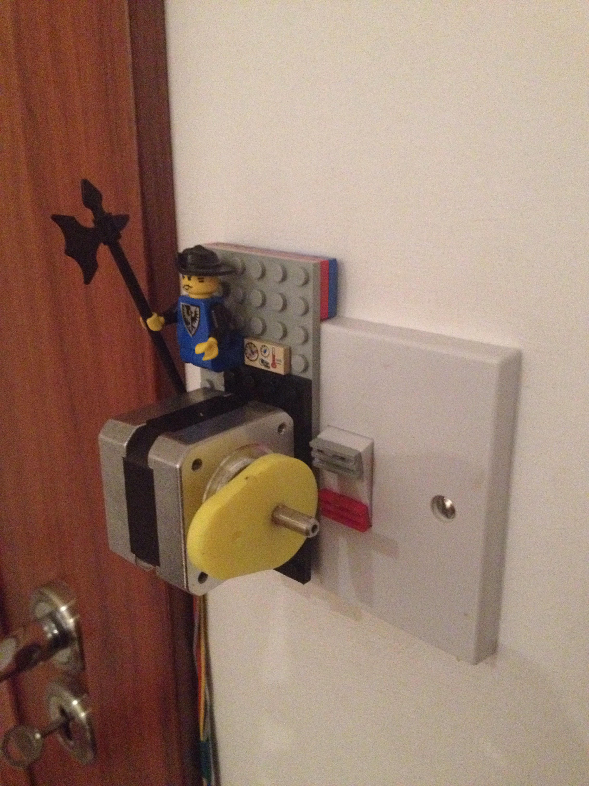
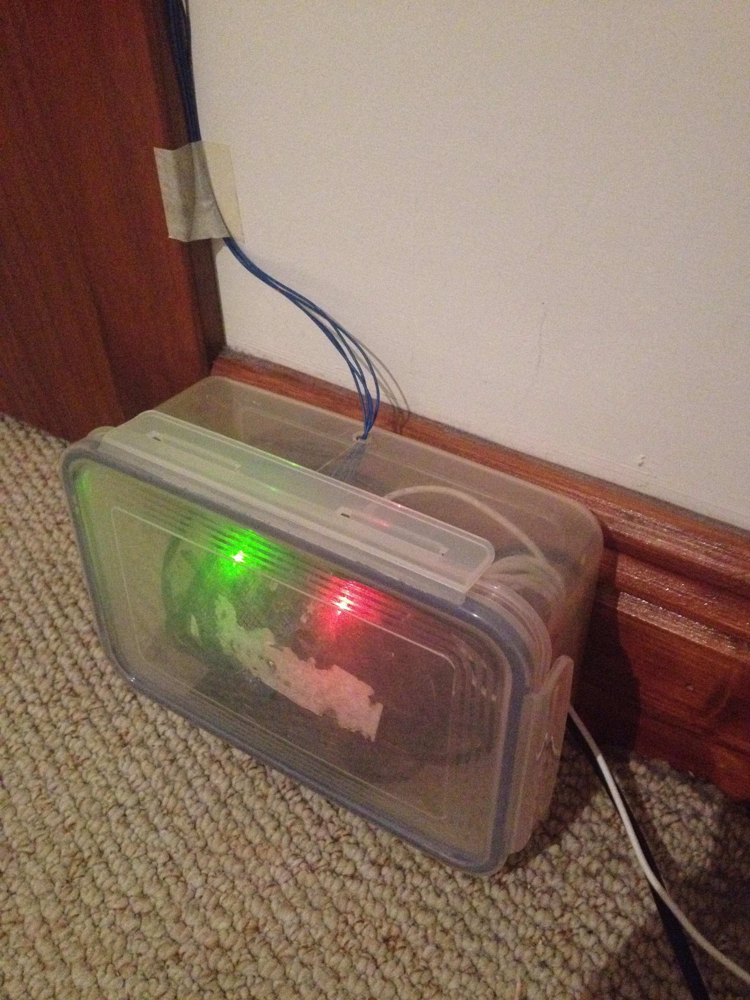

### StepperMotorLightSwitchPi
First bit of home automation.  Stepper motor on a cron job to turn on lights as an alarm clock in the morning.  Was a lot of fun making this. Can't wait to do more with the Pi. 

